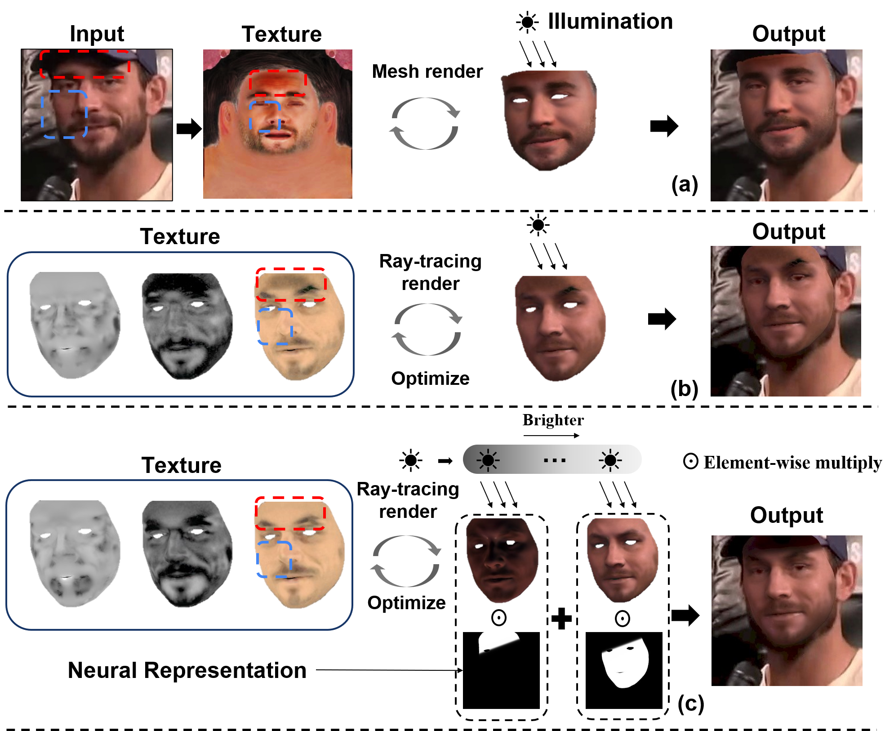

# DeFace

> Learning to Decouple the Lights for 3D Face Texture Modeling  
> Tianxin Huang, Zhenyu Zhang, Ying Tai, Gim Hee Lee  
> NeurIPS'24 



[My Personal Page :)](https://tianxinhuang.github.io/) | [Our Project Page :)](https://tianxinhuang.github.io/projects/Deface)

## TODO List and ETA
- [x] Code for optimization.

- [ ] Upload datasets and other adopted data (expected before 2024-12-11).


## Installation

1. Clone/download this repositry;

2. Install Cuda 11.1;

3. run: 

```
pip install -r requirements.txt
```

4. We introduce [BiSeNet](https://github.com/zllrunning/face-parsing.PyTorch) for the segmentation of face region. Please download its checkpoint ('79999.pth') and put it under ('faceparsing/res/cp')

5. Please download the [baselMorphableModel]() and unzip it under the dir. 

The sub-folders under ('Deface') should be organized as

```
Deface/
├── cfgs/
│   ├── vox2_img.ini
│   ├── por_img.ini
│   ├── celeba.ini
│   └── vox2_seq.ini
├── faceparsing/
│   ├── ...
│   └── res/
│       └──cp/79999.pth
├── baselMorphableModel
└── ...
```

## How to Use

Just replace following dirs with your own ones, and run the optimization with:

```
python3 evaluate.py --configs your_config_dir --input_dir your_img_dir --output_dir your_output_dir --ckpt_dir your_ckpt_dir >log.txt
```

We have provided 4 different config files for our evaluation data in the ('cfgs') dir. You can also adjust the hyper-parameters for your own data.


After running the optimization, you can evaluate the performances by:

```
python3 metrics.py --input_dir your_img_dir --output_dir your_output_dir --result_dir your_result_file.txt
```

Then, the quantitative results would be written into the ('--result_dir').


## Citation

If you find our work useful, please cite:

```bibtex
@inproceedings{huanglearning,
  title={Learning to Decouple the Lights for 3D Face Texture Modeling},
  author={Huang, Tianxin and Zhang, Zhenyu and Tai, Ying and Lee, Gim Hee},
  booktitle={The Thirty-eighth Annual Conference on Neural Information Processing Systems}
}
```

```bibtex
@inproceedings{dib2021practical,
  title={Practical face reconstruction via differentiable ray tracing},
  author={Dib, Abdallah and Bharaj, Gaurav and Ahn, Junghyun and Th{\'e}bault, C{\'e}dric and Gosselin, Philippe and Romeo, Marco and Chevallier, Louis},
  booktitle={Computer Graphics Forum},
  volume={40},
  number={2},
  pages={153--164},
  year={2021},
  organization={Wiley Online Library}
}
```

# Acknowledgements
We built our source codes based on [NextFace](https://github.com/abdallahdib/NextFace).


# contact 
mail: 21725129 @at zju.edu.cn

twitter: @huangtxx
